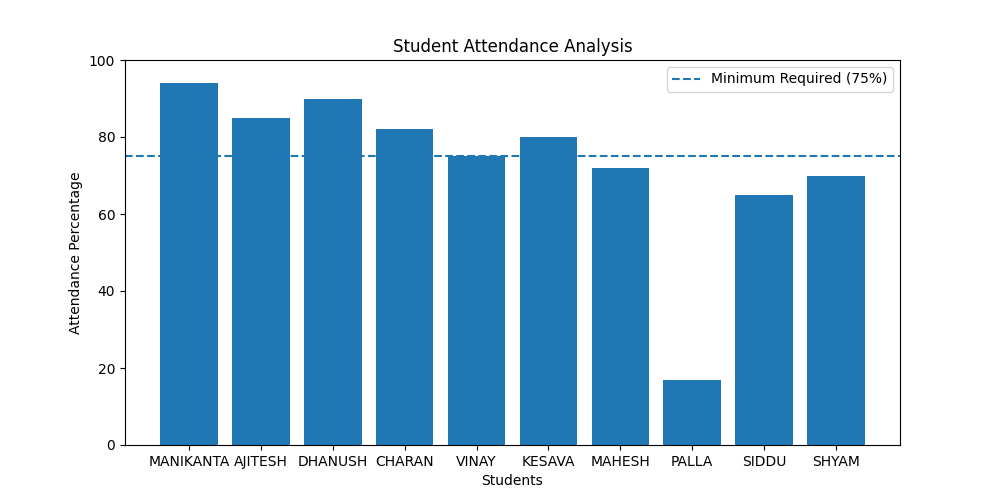

# Student Attendance Analysis

## 📌 Project Overview

Student Attendance Analysis is a Python-based data analytics project that reads attendance records from an Excel file, calculates attendance percentages, identifies students with low attendance, generates reports, and visualizes attendance statistics using a bar chart.

This project demonstrates the use of Pandas, NumPy, Matplotlib, and OpenPyXL for data processing, analysis, and visualization.

---

## 🚀 Features

* Read attendance data from an Excel file
* Calculate attendance percentage for each student
* Find average attendance percentage
* Identify students below the minimum attendance requirement (75%)
* Find students with the highest and lowest attendance
* Generate an attendance report
* Export processed data to a new Excel file
* Visualize attendance using a bar chart

---

## 🛠 Technologies Used

* Python
* Pandas
* NumPy
* Matplotlib
* OpenPyXL

---

## 📂 Project Structure

```text
Student-Attendance-Analysis/
│
├── attendance_analysis.py
├── attendance.xlsx
├── Attendance_Report.xlsx
├── attendance_chart.png
└── README.md
```

---

## 📊 Input Data Format

The Excel file contains the following columns:

| ROLL_NO | STUDENT   | TOTAL C LASSES | ATTENDED CLASSES |
| ------- | --------- | -------------- | ---------------- |
| 1       | MANIKANTA | 100            | 94               |
| 2       | AJITESH   | 100            | 85               |
| 3       | DHANUSH   | 100            | 90               |
| 4       | CHARAN    | 100            | 82               |

---

## ⚙️ Installation

Install the required Python libraries:

```bash
pip install pandas numpy matplotlib openpyxl
```

---

## ▶️ How to Run

Execute the Python script:

```bash
python attendance_analysis.py
```

---

## 📈 Output

The program generates:

* Attendance percentage for each student
* Highest attendance student
* Lowest attendance student
* Students below 75% attendance
* Attendance visualization chart
* Excel report file (`Attendance_Report.xlsx`)

---

## 📝 Sample Output

```text
Highest Attendance:
MANIKANTA - 94%

Lowest Attendance:
PALLA - 17%

Students Below 75% Attendance:

VINESH - 72%
PALLA - 17%
SIDDU - 65%
SHYAM - 70%
```

---

## 📉 Visualization

The project displays a bar chart showing:

* Student attendance percentages
* Minimum attendance requirement (75%) reference line

This helps identify students who are at risk of falling below attendance requirements.

---



## 🎯 Learning Outcomes

Through this project, I learned:

* Reading Excel files using Pandas
* Data manipulation and analysis
* Statistical calculations using NumPy
* Data visualization using Matplotlib
* Exporting processed data to Excel
* Building real-world data analytics projects

---

## 🔮 Future Enhancements

* Subject-wise attendance analysis
* Monthly attendance tracking
* Pie chart visualization
* Interactive dashboard using Streamlit
* Attendance prediction using Machine Learning

---

## 👨‍💻 Author

**Matte Veera Venkata Manikanta**

GitHub: [https://github.com/24A31A05FP]

LinkedIn: [https://www.linkedin.com/in/matte-veera-venkata-manikanta-428a0032a]
